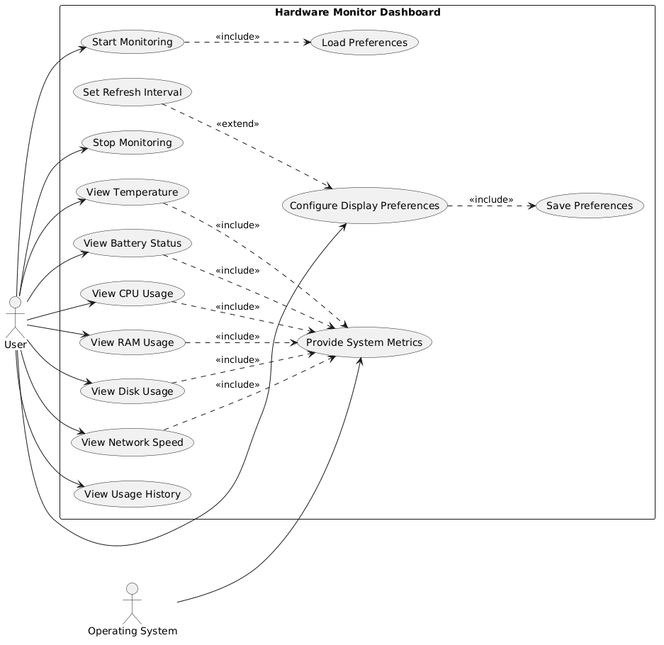

# 🖥️ Hardware Monitor Dashboard

## 1. Title & Team

**Hardware Monitor Dashboard** — a lightweight, real-time hardware monitoring dashboard built with Python, Streamlit and psutil.

| Member | Role |
|---|---|
| Manoel Araújo Veloso Neto | Creator of the entire project |
| Winston Lee | Advising professor |

## 2. Problem Solved

Keeping track of a computer's physical health isn't always visually intuitive. When performing preventive maintenance on a machine — such as opening up a laptop to replace the CPU cooling fan — you often need to validate whether the internal components are running at ideal temperatures under load.

Commercial monitoring software tends to be heavy, run unnecessary background processes, and have overly complex interfaces. This project solves that pain point by providing a **simple, lightweight, and visual** tool that delivers an instant diagnosis of the machine's state — useful both for validating hardware maintenance and for spotting performance bottlenecks during gaming sessions or development work.

## 3. MVP Features

- **CPU**: total usage and per-core usage
- **RAM**: usage percentage and amount used (MB)
- **Disk**: usage percentage of the main partition
- **Network**: real-time download/upload speed (MB/s)
- **Temperature**: internal sensor readings (when supported by the OS)
- **Battery**: charge percentage and charging status (on laptops)
- **History**: line chart showing CPU, RAM, and Disk usage over time
- **Persistent preferences**: the user chooses which charts to display, and that choice is automatically saved for the next session

### Use Case Diagram



## 4. Data Structure

The user's preferences about which charts should appear on screen are persisted in a `preferences.json` file, automatically created on first run and updated whenever the user changes an option in the sidebar:

```json
{
  "refresh_interval": 2,
  "show_per_core": true,
  "show_temperature": true,
  "show_network": true,
  "show_history": true
}
```

| Field | Type | Description |
|---|---|---|
| `refresh_interval` | `int` | Dashboard refresh interval, in seconds |
| `show_per_core` | `bool` | Whether to display the per-core CPU usage chart |
| `show_temperature` | `bool` | Whether to display the temperature panel |
| `show_network` | `bool` | Whether to display the network (download/upload) panel |
| `show_history` | `bool` | Whether to display the historical line chart |

Reading and writing this file is handled by the `load_preferences()` and `save_preferences()` functions in `logic.py`.

## 5. 3+ Unit Test Targets

Tests live in `test_app.py` and use Python's standard `unittest` library (with `unittest.mock` to simulate `psutil` responses, without depending on real hardware). Rules under test:

1. **Unit conversion and network speed calculation** (`bytes_to_mb`, `calculate_speed`)
   - Bytes are correctly converted to MB
   - Speed is correctly calculated from accumulated bytes and elapsed time
   - No division-by-zero error when the elapsed time is virtually zero
   - Returns `0` (never a negative value) when the network counter is reset by the OS

2. **Temperature and battery sensor readings** (`get_temperatures`, `get_battery`)
   - Returns the correct data when sensors are available
   - Returns an empty dictionary / `(None, None)` when the OS doesn't support the reading, without crashing the app

3. **Preferences persistence in JSON** (`load_preferences`, `save_preferences`)
   - Returns the default preferences when the file doesn't exist yet
   - Saves and reloads preferences correctly (round-trip)
   - Returns the default preferences when the JSON file is corrupted
   - Correctly merges a saved file with missing keys, filling them in with default values

## 6. How to Run

This project uses [**uv**](https://docs.astral.sh/uv/) for dependency management.

**Install dependencies:**
```bash
uv sync
```

**Run the dashboard:**
```bash
uv run streamlit run app.py
```

The dashboard will automatically open in your browser at `http://localhost:8501`.

**Run the tests:**
```bash
uv run python -m unittest test_app.py -v
```

## ⚠️ Notes

- **Temperature** readings (`psutil.sensors_temperatures`) depend on the operating system. They work more reliably on **Linux**; on **Windows** and **macOS** they may not be available without additional drivers/libraries.
- **Battery** readings are only returned on laptops/devices that have a battery.

## 📈 Future Improvements

- [ ] Export reading history to CSV
- [ ] Visual alerts when temperature/CPU exceeds a configurable threshold
- [ ] Support for multiple disks/partitions
- [ ] Monitoring of the top CPU/RAM-consuming processes
- [ ] "Gaming session" mode with peak logging

## 📄 License

This project is licensed under the MIT License — feel free to use, modify, and distribute it.
